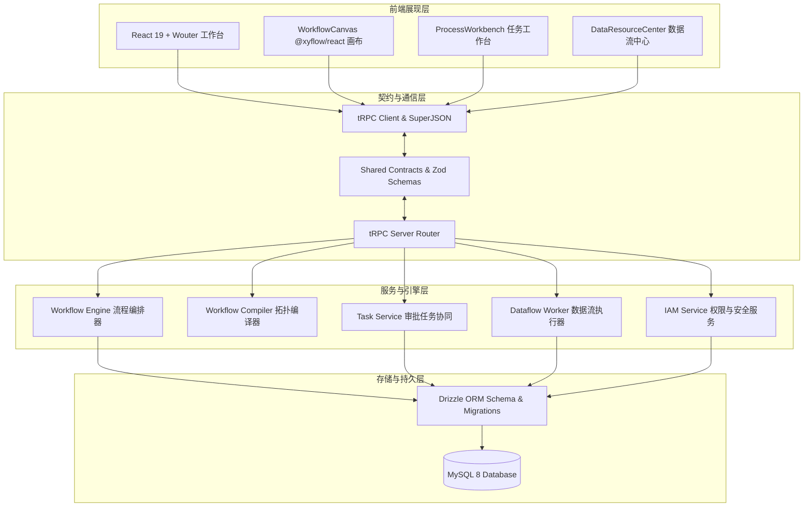

# AiFlowGraph 技术栈设计文档

## 文档信息

| 字段 | 内容 |
| -- | -- |
| 项目名称 | AiFlowGraph AI流程引擎系统 |
| 项目英文名 | flow-ai-engine |
| 文档版本 | V1.0 |
| 创建日期 | 2026-09-15 |
| 创建人员 | AiTest 自动化测试团队 |
| 关联需求文档 | docs/aiflow-reference-baseline.md, docs/aiflow-reference-page-action-matrix.md |
| 关联源码路径 | flow-ai-engine |

## 变更记录

| 版本 | 日期 | 变更人 | 变更内容 |
| -- | -- | -- | -- |
| V1.0 | 2026-09-15 | AiTest 自动化测试团队 | 初始版本，完成技术栈选型、架构设计、核心技术与编译部署分析 |

## 目录

- [1. 技术栈选型分析](#1-技术栈选型分析)
- [2. 系统架构设计](#2-系统架构设计)
- [3. 核心技术实现](#3-核心技术实现)
- [4. 编译与部署](#4-编译与部署)
- [5. 项目目录结构](#5-项目目录结构)
- [6. 技术亮点](#6-技术亮点)

## 1. 技术栈选型分析

### 1.1 技术栈清单

| 分类 | 技术 | 版本 | 选型理由 |
| -- | -- | -- | -- |
| 编程语言 | TypeScript | 5.9.3 | 全栈强类型支持，提供严格的前后端契约推导与编译期语法安全 |
| 前端框架 | React | 19.2.1 | 最新 React 19 并发特性、动作处理与极致组件渲染性能 |
| 构建工具 | Vite | 7.1.7 | 超快的热更新开发体验与基于 Rollup 的高效生产分块构建 |
| 样式系统 | Tailwind CSS | 4.1.14 | 现代原子化 CSS、极速编译及出色的移动端响应式支持 |
| 路由方案 | Wouter | 3.3.5 | 极轻量路由管理（< 2KB），支持精细的客户端与哈希路由同步 |
| 画布引擎 | @xyflow/react | 12.11.3 | 行业领先的可视化节点图表引擎（React Flow 12），支持自定义 Handle 与平移缩放 |
| 组件基建 | Radix UI | 最新稳定版 | 无障碍无样式原始组件，提供极高的交互定制灵活性与键盘导航支持 |
| 服务端框架 | Express | 4.21.2 | 成熟稳定的 Node.js HTTP 基础通信底座 |
| API 契约协议 | tRPC | 11.6.0 | 端到端类型安全的 RPC 通信协议，消除前后端 API 契约漂移 |
| ORM 映射 | Drizzle ORM | 0.44.5 | 轻量级、零运行时开销的 TypeScript SQL 映射与迁移工具 |
| 数据库驱动 | mysql2 | 3.15.0 | 高性能 MySQL 8 数据库通信连接池与异步事务支持 |
| 状态校验 | Zod | 4.1.12 | 强大的运行时模式校验与 TypeScript 类型自动推导 |
| 测试框架 | Vitest | 2.1.4 | 现代化轻量极速测试引擎，无缝兼容 Vite 别名与模块系统 |

### 1.2 技术选型原则
- **契约一致性原则**：前后端完全共用 `shared/` 下的 TypeScript 契约与 Zod 校验，确保前后端字段零偏差。
- **性能与体积预算原则**：通过动态分块与按需懒加载，将各 UI Chunk 严格控制在 450 KiB 预算以内。
- **高韧性原则**：采用有向无环图静态编译、事务级状态机迁移与防暴力破解认证机制，确保生产级稳定性。

### 1.3 技术对比分析

| 技术选项 | 优点 | 缺点 | 最终选择 |
| -- | -- | -- | -- |
| 通信协议：tRPC vs RESTful API | 端到端类型自动推导，重构无损，零手写 API client | 仅适用于前后端同构 TS 场景 | 最终选择 **tRPC** |
| ORM：Drizzle vs Prisma | 零开销生成原生 SQL，极致冷启动与极低内存占用 | 需要熟练掌握 SQL 语义 | 最终选择 **Drizzle** |
| 画布引擎：@xyflow/react vs AntV X6 | 纯 React 响应式驱动，生命周期与状态管理天然契合 | 对非 React 技术栈不通用 | 最终选择 **@xyflow/react** |

## 2. 系统架构设计

### 2.1 架构风格
系统采用**模块化单体（Modular Monolith）与前后端同构（Full-Stack TypeScript）架构**。前端以组件树、画布状态机和响应式页签为核心；后端以 tRPC 路由为接入层，通过服务层拆分业务、流程、数据流与 IAM 逻辑，底层由 Drizzle ORM 统一管理事务与持久化。

### 2.2 架构图



### 2.3 模块划分

| 模块编号 | 中文名 | 英文名 | 职责 | 依赖关系 | 说明 |
| -- | -- | -- | -- | -- | -- |
| M001 | 流程设计器画布与配置 | Workflow Designer & Canvas | 负责节点编排、多出口连线、属性检查器与测试试运行 | 依赖 tRPC、@xyflow/react | 核心交互中心 |
| M002 | 业务中心与项目工作区 | Business Center & Project Workspace | 负责业务项目容器、CSV导入、流程审核发布与服务端点 | 依赖 M001, M006, tRPC | 业务承载中心 |
| M003 | 已启动流程工作台与运行中心 | Process Workbench & Run Center | 负责看板待办分发、单任务/批量审批办理、运行状态监控 | 依赖 M002, tRPC | 流程协同核心 |
| M004 | 数据资源中心 | Data Resource Center | 负责数据源探查、数据资产元数据、UDF函数与Cron调度 | 依赖 M002, tRPC | 数据处理核心 |
| M005 | 流程仓库与归档治理 | Workflow Warehouse & Governance | 负责目录树归整、流程归档恢复、批量JSON导出与导入 | 依赖 M001, M002 | 资产复用中心 |
| M006 | 系统配置与组织架构 | System Config & Organization Management | 负责系统级通用设置、工作域管理、多级组织树与权限继承 | 依赖 M007, tRPC | 组织基座中心 |
| M007 | 内部身份中心与安全认证 | IAM & Internal Authentication | 负责用户凭据签发、防爆破保护、自定义角色与授权审计 | 基础依赖模块 | 安全核心底座 |

### 2.4 关键设计决策

| 决策编号 | 决策描述 | 决策理由 | 影响范围 |
| -- | -- | -- | -- |
| D001 | 采用 tRPC 替代传统 REST API | 流程定义配置极其复杂，端到端类型安全可杜绝字段名不一致缺陷 | 全局前后端通信 |
| D002 | 画布操作节点支持显式多出口连线 | 传统单出口连线无法表达不同审批结果的分支路由，显式出口解耦了业务逻辑 | M001 画布与拓扑编译 |
| D003 | 流程发布实施审核门禁（auditStatus） | 企业流程变更影响重大，强制要求审核通过方可投入生产运行 | M002 与发布逻辑 |
| D004 | 认证服务实施防暴力破解频率控制 | 内存与 IP 复合限流，5 次失败自动锁定，有效防范字典攻击 | M007 登录认证 |

## 3. 核心技术实现

### 3.1 核心机制
1. **拓扑排序与无环验证**：流程编译器在 `workflow-compiler.ts` 中对 Definition 进行入度与出度分析，基于 Kahn 算法生成确定性执行计划，计算不可变 PlanHash。
2. **多模式审批流转机**：操作节点支持或签（1 人通过即生效）、会签（全员同意通过）、顺序会签，并通过状态机实时更新 `approvalProgress`。
3. **安全数据流探查**：数据源测试连接严格防范私网 SSRF，限制连接超时（默认 15s），阻断恶意地址。

### 3.2 关键算法：显式操作多出口连接校验
在 `WorkflowCanvas.tsx` 中，通过检查 `outcomeMode === 'explicit'` 判定是否放行多分支连线：
```ts
const outgoing = edges.filter(edge => edge.source === source.id);
const isExplicitOperate =
  source.data.kind === "operate" &&
  readOperateOutcomeMode(source.data.config) === "explicit";

if (
  (["start", "rest"].includes(source.data.kind) ||
    (source.data.kind === "operate" && !isExplicitOperate)) &&
  outgoing.length > 0
)
  return false;
```

### 3.3 数据持久化
- 使用 MySQL 8 存储结构化业务实体（`project`, `workflow`, `workflow_version`, `workflow_task`, `organization_unit`, `user` 等）。
- 流程定义统一采用 JSON 存储，并由 `schemaVersion: 1` 保证向前兼容。

## 4. 编译与部署

### 4.1 编译构建
- **前端生产构建**：
  ```bash
  pnpm build
  ```
  该命令依次执行 `vite build`、分块预算审计 `pnpm check:bundle`，以及基于 `esbuild` 的后端一体化构建。
- **打包预算约束**：单 Chunk 不得超过 450 KiB，总包体不得超过 1300 KiB。

### 4.2 部署架构
- 支持 Docker 容器化一键交付（基于 `Dockerfile` 与 `compose.yaml`）。
- 服务端以 Node.js 生产环境运行于 `dist/index.js`，静态资源由内置静态服务托管。

### 4.3 环境要求
- **Node.js**：v20.x 或更高版本。
- **包管理器**：pnpm v10.x。
- **数据库**：MySQL 8.0+。

## 5. 项目目录结构

### 5.1 目录结构

```
flow-ai-engine/
├── client/                     # 前端工程
│   ├── index.html
│   └── src/
│       ├── App.tsx             # 根路由与主题配置
│       ├── main.tsx            # 入口加载与水合
│       ├── components/         # 业务与 UI 组件（Canvas, Workbench, Project 等）
│       ├── pages/              # 页面容器（Home, NotFound 等）
│       └── lib/                # tRPC 客户端与工具类
├── server/                     # 服务端工程
│   ├── _core/                  # 通信内核、Cookie、系统路由与登录防刷
│   ├── routers.ts              # tRPC 全量主路由
│   ├── workflow-compiler.ts    # 拓扑编译器
│   ├── workflow-engine.ts      # 流程执行引擎
│   ├── p1-service.ts           # 审批与任务协同服务
│   ├── p2-service.ts           # 数据流与调度服务
│   ├── iam-service.ts          # 组织与角色权限服务
│   └── organization-service.ts # 组织架构树服务
├── shared/                     # 前后端共用契约与类型定义
│   ├── workflow-node-contract.ts
│   ├── flow-profile-contract.ts
│   └── console-route.ts
├── tests/                      # 自动化测试套件
│   └── functional/             # 7 大模块固化功能测试套件
├── scripts/                    # 打包预算与数据种子脚本
└── package.json
```

### 5.2 核心代码文件说明
- `client/src/components/WorkflowCanvas.tsx`：流程画布主控，负责节点渲染、连线管理、右键菜单与节点检查器。
- `server/routers.ts`：系统 tRPC API 集中定义，暴露全量 query 与 mutation 过程。
- `shared/workflow-node-contract.ts`：定义 33 种节点类型、默认配置与严格校验规则。

## 6. 技术亮点
1. **全栈强类型协同**：基于 TypeScript + tRPC + Zod 打造端到端类型流，重构与字段变更直接在编译期得到校验。
2. **严苛的包体预算监控**：集成 `check-bundle-budget.mts` 实时把控构建体积，保障首屏秒级加载。
3. **高韧性固化测试体系**：拥有 43 项细致到按钮与配置项的功能测试与 251 项核心回归测试，为系统演进保驾护航。
