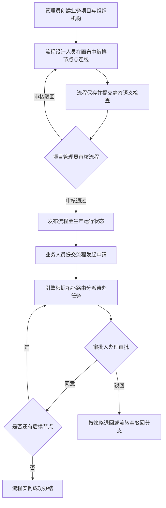
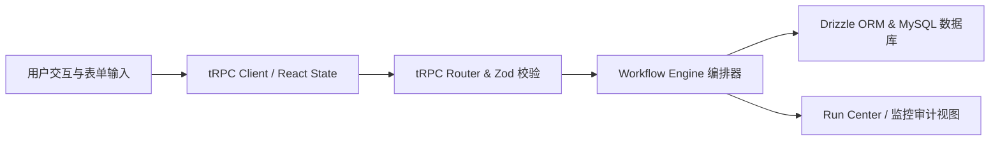
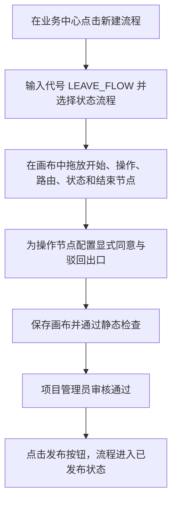
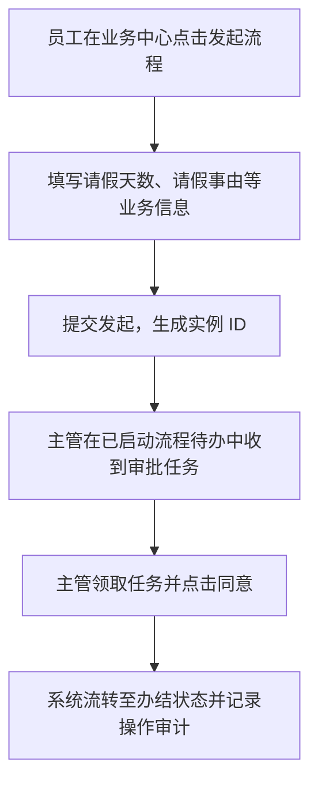
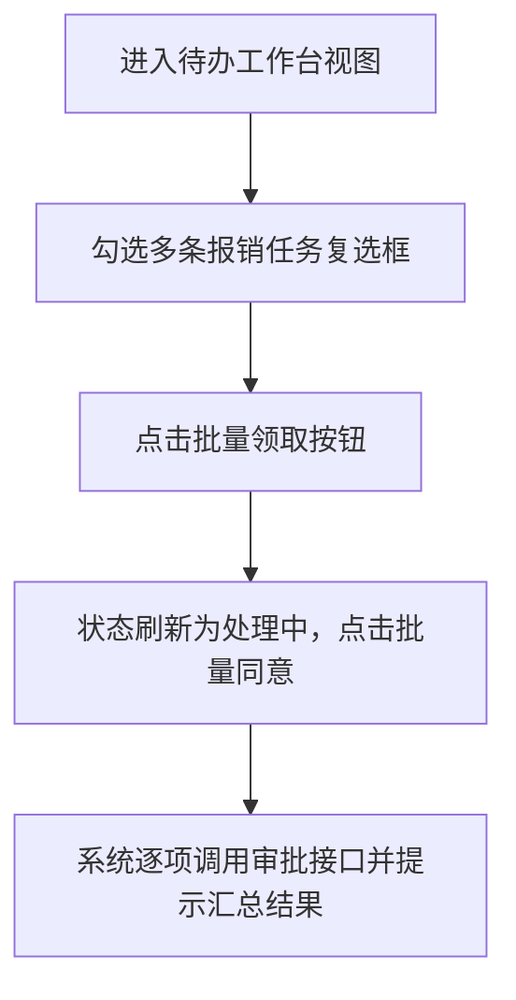
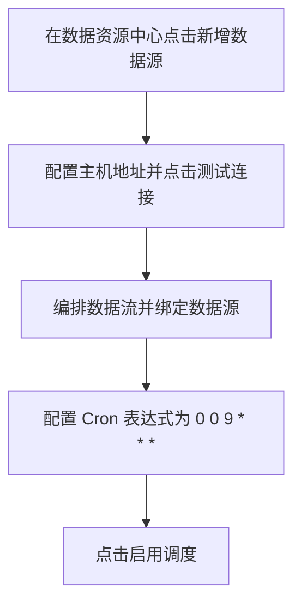
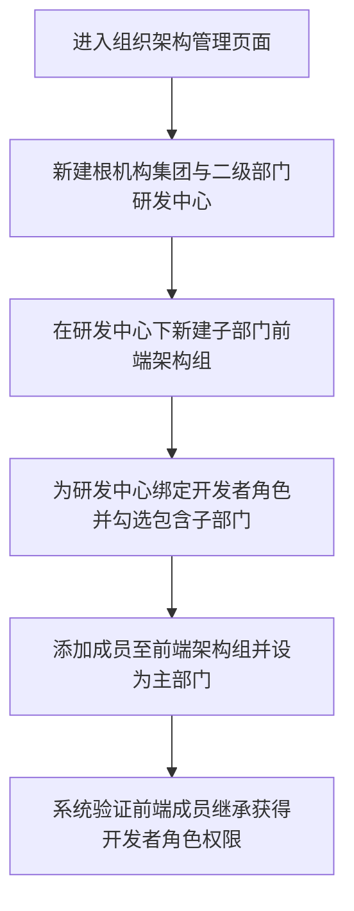

# AiFlowGraph 测试分析文档

## 文档信息

| 字段 | 内容 |
| -- | -- |
| 项目名称 | AiFlowGraph AI流程引擎系统 |
| 项目英文名 | flow-ai-engine |
| 文档版本 | V1.0 |
| 创建日期 | 2026-09-15 |
| 创建人员 | AiTest 自动化测试团队 |
| 关联需求文档 | docs/aiflow-reference-baseline.md, docs/aiflow-reference-page-action-matrix.md |
| 关联源码路径 | flow-ai-engine |

## 变更记录

| 版本 | 日期 | 变更人 | 变更内容 |
| -- | -- | -- | -- |
| V1.0 | 2026-09-15 | AiTest 自动化测试团队 | 初始版本，完成 7 大核心模块需求分析与典型场景设计 |

## 目录

- [1. 项目背景与目标](#1-项目背景与目标)
- [2. 核心功能模块](#2-核心功能模块)
- [3. 业务流程与数据流](#3-业务流程与数据流)
- [4. 典型使用场景](#4-典型使用场景)
- [5. 总结](#5-总结)

## 1. 项目背景与目标

### 1.1 项目背景
AiFlowGraph（flow-ai-engine）是面向企业数字化转型的一站式 AI 流程与数据流编排引擎。它打破了传统审批流、系统服务调用流和数据 ETL 流之间的壁垒，提供支持状态流（State Flow）、控制流（Control Flow）和数据流（Data Flow）三种流程范式的现代工作台，支持复杂审批流转（会签/或签/顺序会签）、动态角色人员解析、服务接口串联以及定时数据调度。

### 1.2 项目目标
1. 建立端到端可视化的 DAG 流程设计器，支持 33 种节点类型与多出口显式连线。
2. 实现多租户多业务工作区隔离，确保项目资产权限受严格 RBAC 与资源所有者保护。
3. 提供统一的待办/已办任务审批工作台与实例生命周期监控。
4. 支撑数据流清洗、UDF 函数计算与多周期 Cron 调度。
5. 构建完善的组织架构树、安全认证防护（防暴力破解）与审计留痕机制。

### 1.3 项目范围
- **包含范围**：前端 Web 工作台、流程编排画布、任务工作台、数据流工作台、后端 tRPC 路由、流程编译器与执行引擎、IAM 权限体系。
- **不包含范围**：第三方商业 BDP 系统内网对接、物理硬件资源虚拟化分配。

## 2. 核心功能模块

### 2.1 模块清单

| 模块编号 | 中文名 | 英文名 | 模块描述 | 优先级 |
| -- | -- | -- | -- | -- |
| M001 | 流程设计器画布与配置 | Workflow Designer & Canvas | 提供可视化流程编排、33类节点配置、多出口连线、静态检查与试运行 | P0（核心功能，流程编排主入口） |
| M002 | 业务中心与项目工作区 | Business Center & Project Workspace | 业务项目管理、CSV批量导入、流程生命周期（创建/审核/发布/发起）及服务端点 | P0（主流程必经，资产与项目承载） |
| M003 | 已启动流程工作台与运行中心 | Process Workbench & Run Center | 待办/已办/我发起任务处理、任务流转操作（领取/移交/加签/减签/审批）及批量处理 | P0（审批业务核心，高频流转主干） |
| M004 | 数据资源中心 | Data Resource Center | 数据源连接探查、数据资产元数据定义、UDF函数、业务标签及Cron数据调度 | P1（数据流业务支撑） |
| M005 | 流程仓库与归档治理 | Workflow Warehouse & Governance | 目录树管理、流程归档（软删除）、可审计恢复、批量JSON导出与导入 | P1（企业资产复用与合规归档） |
| M006 | 系统配置与组织架构 | System Config & Organization Management | 通用平台设置、审批前置策略、工作域管理、多层级组织机构树与角色继承 | P1（企业基础设置与组织架构） |
| M007 | 内部身份中心与安全认证 | IAM & Internal Authentication | 登录防爆破、用户启停、自定义系统角色、权限矩阵分析与AI批量账号生成 | P0（安全基础设施，系统访问控制基石） |

### 2.2 模块详细说明

#### 2.2.1 流程设计器画布与配置（对应2.1中模块编号 M001）
- **功能描述**：基于 `@xyflow/react` 深度定制的交互式流程画布。提供 33 类标准节点（包括 state、operate、router、rest、method、form、sql、llm、subflow 等），支持拖拽添加、画布自适应整理、连线删除与撤销、多节点横竖向对齐、显式出口多分支连线及属性检查器。
- **核心流程**：选择流程 -> 进入设计器 -> 拖放节点 -> 建立拓扑连线 -> 配置节点属性 -> 语义校验 -> 保存并导出/试运行。
- **关键接口**：`workflow.get`, `workflow.update`, `workflow.compile`, `workflow.previewParticipants`, `workflow.run`。
- **业务规则**：禁止连入 start，禁止连出 end；状态/控制流程与数据流程节点类型不可混用；显式操作节点支持多分支出口。

#### 2.2.2 业务中心与项目工作区（对应2.1中模块编号 M002）
- **功能描述**：业务项目（Project）的全生命周期容器。支持列式 CSV 导入外部业务、多条件组合筛选业务、流程列表查询、创建状态/控制/数据流程、流程审核通过/驳回、发布与取消发布、业务发起弹窗及服务端点（EndpointRef）管理。
- **核心流程**：新建/导入业务 -> 进入工作区 -> 新建流程 -> 审批通过 -> 发布流程 -> 业务表单发起。
- **关键接口**：`project.list`, `project.create`, `project.workflows`, `project.createWorkflow`, `project.auditWorkflow`, `workflow.publish`, `workflow.unpublish`, `project.createServiceEndpoint`。
- **业务规则**：业务代号与流程代号全局唯一且强制大写；数据流程创建时必须绑定未停用数据源；发布前必须处于 approved 审核状态。

#### 2.2.3 已启动流程工作台与运行中心（对应2.1中模块编号 M003）
- **功能描述**：面向业务操作员与各级主管的审批协同中心。提供我的看板、日历、待办、已办、我发起、全部流程等 6 种视图；支持任务领取、移交、委托代理、加签、减签、退回待处理、审批办理（同意/驳回/弃权）及批量处理。
- **核心流程**：流程发起 -> 待办生成 -> 领取任务 -> 审核表单填写 -> 提交决定 -> 状态流转或结束。
- **关键接口**：`task.list`, `task.claim`, `task.complete`, `task.handover`, `task.delegate`, `task.addSigner`, `task.removeSigner`, `task.returnToPending`, `task.batchClaim`, `task.batchComplete`。
- **业务规则**：驳回操作强制填写处理意见；或签 1 人同意即通过，会签需全员同意；未完成审批的加签人可被减签。

#### 2.2.4 数据资源中心（对应2.1中模块编号 M004）
- **功能描述**：数据流程基础设施。提供 JDBC、API、File 等多源连接探查测试；维护数据资产字段 Schema 与样例数据；登记 SQL/JS/Python/JAR UDF 函数；维护业务颜色标签；配置 Cron 表达式定时调度并监控执行血缘。
- **核心流程**：配置数据源 -> 连接探查 -> 注册数据资产/UDF -> 编排数据流 -> 设置 Cron 调度 -> 自动化执行与血缘分析。
- **关键接口**：`data.createSource`, `data.testSource`, `data.createAsset`, `data.createUdf`, `data.createTag`, `data.saveScheduleDraft`, `data.activateSchedule`, `data.pauseSchedule`, `data.run`。
- **业务规则**：Cron 表达式必须符合标准规范；数据源测试探测需防范私网 SSRF 风险；标签色值必须符合 Hex 规范。

#### 2.2.5 流程仓库与归档治理（对应2.1中模块编号 M005）
- **功能描述**：企业级流程模板与资产复用中心。提供平级与子级目录树结构；支持跨目录流程迁移；提供包含版本与定义的批量 JSON 导出与导入；提供合规的软删除归档与一键恢复。
- **核心流程**：创建目录树 -> 归整流程 -> 批量导出 JSON 备份 / 从外部导入 -> 废弃流程归档 -> 审计恢复。
- **关键接口**：`project.createFolder`, `project.updateFolder`, `project.deleteFolder`, `project.moveWorkflow`, `project.exportWorkflows`, `workflow.delete`, `workflow.restore`。
- **业务规则**：存在子目录或关联流程的文件夹禁止直接删除；已归档流程保留所有历史运行与审计，但禁止发起新实例。

#### 2.2.6 系统配置与组织架构（对应2.1中模块编号 M006）
- **功能描述**：平台全局运行策略与多层级组织架构管理。支持平台名称、水印文本策略配置；审批前置与独立复核规则；多工作域维护；多层级组织机构树（根部门、子部门）、成员主职与兼职岗位调配、系统角色向下继承。
- **核心流程**：配置平台与工作域 -> 搭建组织架构树 -> 关联内部成员与主部门 -> 绑定组织角色 -> 权限向下继承生效。
- **关键接口**：`config.updateSetting`, `config.createWorkDomain`, `config.createOrganizationUnit`, `config.assignOrganizationMember`, `config.setPrimaryOrganizationMembership`, `config.moveOrganizationMember`, `config.bindOrganizationRole`。
- **业务规则**：平台配置变更需 admin 权限；单用户在系统中只可拥有一个主部门；启用包含子部门时，下级机构自动继承父级权限组。

#### 2.2.7 内部身份中心与安全认证（对应2.1中模块编号 M007）
- **功能描述**：系统安全与访问控制基石。基于 Cookie 的认证凭据管理；防暴力破解登录限制（连续失败 5 次触发锁定）；内部账号管理；强密码校验（>=12字符）；AI 批量账号生成；自定义系统角色创建与授权审计记录。
- **核心流程**：用户登录（触发防爆破计数）-> 鉴权会话建立 -> 分配角色权限 -> 关键操作写入审计日志。
- **关键接口**：`auth.login`, `auth.logout`, `iam.createUser`, `iam.updateUserStatus`, `iam.previewUserBatch`, `iam.createUsersBatch`, `iam.createCustomRole`, `iam.assignSystemRole`, `iam.authorizationAudit`。
- **业务规则**：系统内置 `system_admin` 角色禁止修改或删除；停用账号立即终止登录能力；所有授权变更记录操作人与时间戳。

## 3. 业务流程与数据流

### 3.1 核心业务流程

#### 3.1.1 主业务流程

**流程说明**：
- 完整贯穿企业工作域初始化、可视化流程设计、审批发布门禁、实例运行调度至任务协同完成。
- 关键决策点涵盖流程定义合规校验、管理员审核、审批人处理决策与下游分支计算。

#### 3.1.2 流程涉及模块

| 步骤 | 涉及模块 | 模块职责 | 交互方式 |
| -- | -- | -- | -- |
| 1. 项目初始化 | M006 系统配置与组织架构, M002 业务中心 | 创建业务空间与组织权限 | tRPC API / 管理界面 |
| 2. 流程编排 | M001 流程设计器画布 | 33类节点编辑与拓扑连接 | Web UI 交互 / React Flow |
| 3. 审核与发布 | M002 业务中心与项目工作区 | 执行合规审核并发布上线 | 数据库状态变更 |
| 4. 实例发起与分发 | M002 项目工作区, M003 已启动流程工作台 | 接收表单参数，创建实例与待办 | 服务端流程引擎调度 |
| 5. 协同审批 | M003 已启动流程工作台 | 领取、移交、加签、表决 | WebSocket/轮询，状态机流转 |

#### 3.1.3 关键决策点

| 决策点 | 判断条件 | 分支路径 | 说明 |
| -- | -- | -- | -- |
| 流程编译门禁 | 是否存在孤立节点、循环死锁、配置缺失 | 编译通过 -> 允许提交；编译失败 -> 定位错误节点 | 前端定位第一项错误 |
| 流程发布门禁 | status === 'draft' 且 auditStatus === 'approved' | 条件满足 -> 发布成功；不满足 -> 拒绝发布 | 防止未审先发 |
| 审批决策流转 | 审批人选择 approved / rejected / abstained | 同意 -> 进下一节点；驳回 -> 终态或异常路由 | 驳回强校验处理意见 |

### 3.2 数据流分析

#### 3.2.1 数据流向图

#### 3.2.2 数据流转详情

| 数据节点 | 数据类型 | 数据结构 | 来源 | 去向 | 流转方式 | 说明 |
| -- | -- | -- | -- | -- | -- | -- |
| 流程定义 | JSON Object | WorkflowDefinition (nodes, edges, viewport) | 流程设计器 | 数据库 workflow 表 | tRPC Mutation | 版本化快照保存 |
| 运行入参 | JSON Object | 结构化业务字段（codeType, businessInfo） | 发起弹窗 | 实例执行上下文 | API 调用 | 写入 run 实例上下文 |
| 任务表决 | JSON Object | approvalResultSchema (decision, comment) | 任务工作台 | 流程状态机 | tRPC Mutation | 驱动节点迁移与审计 |
| 审计记录 | JSON Array | AuthorizationAudit (actor, action, target) | IAM 模块 | 系统日志视图 | ORM 写入 | 全程不可篡改追踪 |

## 4. 典型使用场景

### 4.1 场景描述

| 场景编号 | 场景名称 | 场景描述 | 涉及模块 | 用户角色 | 优先级 |
| -- | -- | -- | -- | -- | -- |
| S001 | 新业务项目初始化与流程编排发布 | 管理员创建业务，设计人员编排请假审批流，审核通过后发布上线 | M001, M002, M006 | 平台管理员, 流程设计员 | P0 |
| S002 | 请假审批申请发起与主管协同办理 | 员工发起请假流程，直属主管在待办工作台中进行加签与审批同意 | M002, M003 | 普通员工, 部门主管 | P0 |
| S003 | 批量任务领取与统一审批表决 | 主管在月末集中处理多笔审批单，使用批量领取与批量同意完成办结 | M003 | 部门主管 | P1 |
| S004 | 数据流定时抽取与调度生命周期管理 | 数据工程师配置 MySQL 数据源，设计清洗流并开启每天 9 点定时调度 | M001, M004 | 数据工程师 | P1 |
| S005 | 企业多级组织架构搭建与角色继承 | HR 管理员录入三级组织架构，绑定研发角色并验证子部门权限继承 | M006, M007 | HR 管理员 | P1 |

### 4.2 场景详细说明

#### 4.2.1 新业务项目初始化与流程编排发布（对应4.1中场景编号 S001）
**用户故事**：作为【流程设计员】，我希望【在业务项目中编排请假审批流程并发布】，以便【企业员工可以规范发起申请】。
**前置条件**：
- 用户已登录且拥有目标业务项目的 designer 或 owner 角色。

**场景流程图**：

**涉及模块交互**：
| 步骤 | 模块 | 操作 | 数据输入 | 数据输出 |
| -- | -- | -- | -- | -- |
| 1 | M002 | 新建流程 | name="请假审批", code="LEAVE_FLOW", flowType="state" | workflowId |
| 2 | M001 | 拖拽编排与配置 | 节点坐标、连线及审批属性 | WorkflowDefinition JSON |
| 3 | M002 | 审核与发布 | auditStatus="approved" -> status="published" | 发布版本快照 |

**预期结果**：流程在业务列表中显示为“已发布”，可在已启动流程中供员工调用。

#### 4.2.2 请假审批申请发起与主管协同办理（对应4.1中场景编号 S002）
**用户故事**：作为【普通员工】，我希望【在线提交请假申请】，以便【主管快速审批并归档】。
**前置条件**：
- 请假审批流程已发布，员工账号处于启用状态。

**场景流程图**：

**涉及模块交互**：
| 步骤 | 模块 | 操作 | 数据输入 | 数据输出 |
| -- | -- | -- | -- | -- |
| 1 | M002 | 确认发起 | expectedEnd, businessInformationOne="年假3天" | runId |
| 2 | M003 | 待办列表刷新 | 用户身份鉴权 | taskId 列表 |
| 3 | M003 | 领取与审批 | decision="approved", comment="同意申请" | 实例流转至下一状态 |

**预期结果**：任务从待办移动至已办，实例状态变为 success，审批耗时被统计。

#### 4.2.3 批量任务领取与统一审批表决（对应4.1中场景编号 S003）
**用户故事**：作为【部门主管】，我希望【批量处理多笔日常报销待办】，以便【节省逐一打开抽屉的处理时间】。
**前置条件**：
- 当前主管待办列表中有 2 笔或以上待处理任务。

**场景流程图**：

**涉及模块交互**：
| 步骤 | 模块 | 操作 | 数据输入 | 数据输出 |
| -- | -- | -- | -- | -- |
| 1 | M003 | 勾选任务并批量领取 | taskIds: ["t1", "t2"] | 批量领取成功统计 |
| 2 | M003 | 批量同意表决 | decision="approved", taskIds | 批量审批完成提示 |

**预期结果**：选中的任务全部完成审批流转，批量操作提示显示“2项成功，0项未处理”。

#### 4.2.4 数据流定时抽取与调度生命周期管理（对应4.1中场景编号 S004）
**用户故事**：作为【数据工程师】，我希望【设定每日数据抽取定时任务】，以便【报表数据每日准时同步】。
**前置条件**：
- 目标项目已登记有效的数据源连接。

**场景流程图**：

**涉及模块交互**：
| 步骤 | 模块 | 操作 | 数据输入 | 数据输出 |
| -- | -- | -- | -- | -- |
| 1 | M004 | 测试连接 | host="10.0.0.12", port=3306 | 探测时延结果 |
| 2 | M004 | 设定并启用 Cron | cronExpression="0 0 9 * * *" | scheduleId, status="active" |

**预期结果**：调度状态显示为“启用”，后台 Worker 准时拉起数据流计算任务。

#### 4.2.5 企业多级组织架构搭建与角色继承（对应4.1中场景编号 S005）
**用户故事**：作为【HR 管理员】，我希望【建立研发中心及其下属前端架构组】，以便【岗位人员自动继承部门权限】。
**前置条件**：
- 管理员已具备 IAM 管理权限。

**场景流程图**：

**涉及模块交互**：
| 步骤 | 模块 | 操作 | 数据输入 | 数据输出 |
| -- | -- | -- | -- | -- |
| 1 | M006 | 新建部门树 | parentUnitId, name="前端架构组" | unitId |
| 2 | M006 | 角色绑定 | roleId, includeDescendants=true | 权限继承生效 |
| 3 | M007 | 权限分析 | userId | 展现直接角色与继承角色清单 |

**预期结果**：前端组员工无需重复绑定角色，即可获得父级研发中心继承的系统权限。

## 5. 总结
本测试分析文档从业务与测试视角系统梳理了 AiFlowGraph 的 7 大核心功能模块，确立了全量 33 类节点的语法与隔离契约，建立了清晰的审批流转业务流与数据流向模型，并构建了 5 项端到端典型应用场景，为后续测试用例的全面覆盖与自动化脚本生成提供了坚实规范。
