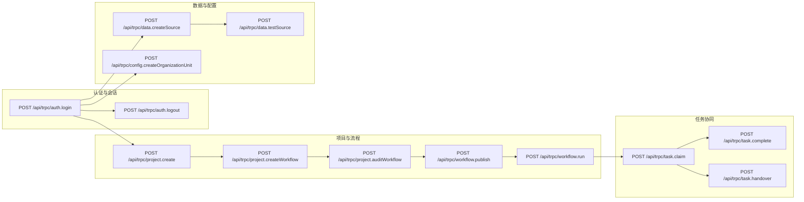

# AiFlowGraph 接口测试用例文档

## 文档信息

| 字段 | 内容 |
| -- | -- |
| 模块名称 | AiFlowGraph 服务端接口层 |
| 模块英文名 | aiflow-trpc-apis |
| 文档版本 | V1.0 |
| 创建日期 | 2026-09-15 |
| 创建人员 | AiTest 自动化测试团队 |
| 关联接口文档 | flow-ai-engine/server/routers.ts |
| 关联源码路径 | flow-ai-engine/server |

## 变更记录

| 版本 | 日期 | 变更人 | 变更内容 |
| -- | -- | -- | -- |
| V1.0 | 2026-09-15 | AiTest 自动化测试团队 | 初始版本，覆盖 tRPC 核心 API 覆盖矩阵与接口用例集 |

## 接口依赖关系图



## 接口覆盖矩阵

| 测试点编号 | 接口名称 | 接口URL | HTTP方法 | 测试点标题 | 详细描述 | 覆盖维度 | 优先级 |
| -- | -- | -- | -- | -- | -- | -- | -- |
| AT001 | 用户凭据登录认证 | `/api/trpc/auth.login` | POST | 正常登录与防爆破锁定 | 验证正常账号登录签发 Cookie，连续 5 次失败后触发 429 锁定 | D1, D2, D4 | P0 |
| AT002 | 业务项目创建 | `/api/trpc/project.create` | POST | 业务代号大写规范与工作域绑定 | 验证代号转大写、唯一性及工作域有效性校验 | D1, D3 | P0 |
| AT003 | 流程创建与数据源绑定 | `/api/trpc/project.createWorkflow` | POST | 状态/控制/数据流创建约束 | 状态流程禁止绑定数据源，数据流必须选择已存在未停用数据源 | D1, D2, D3 | P0 |
| AT004 | 流程审核状态流转 | `/api/trpc/project.auditWorkflow` | POST | 流程审核通过与驳回 | 仅项目管理员有权审批，更新 auditStatus 为 approved / rejected | D3, D4 | P0 |
| AT005 | 流程发布与取消发布 | `/api/trpc/workflow.publish` | POST | 审核通过门禁与发布状态流转 | 未通过审核禁止发布，发布后生成不可变执行快照并允许取消发布 | D3, D5 | P0 |
| AT006 | 流程实例发起执行 | `/api/trpc/workflow.run` | POST | 结构化上下文入参并发起实例 | 校验输入字段，生成 runId 并拉起执行引擎分配待办 | D1, D3 | P0 |
| AT007 | 人工任务领取 | `/api/trpc/task.claim` | POST | 任务所有权绑定与防重复领取 | 仅 pending 任务可被领取，状态流转为 claimed 并记录处理人 | D2, D3 | P0 |
| AT008 | 人工任务办理审批 | `/api/trpc/task.complete` | POST | 表决结果与驳回意见必填校验 | 校验 decision 枚举，驳回时强制校验 comment 非空，驱动引擎流转 | D1, D2, D3 | P0 |
| AT009 | 任务移交与代理 | `/api/trpc/task.handover` | POST | 任务移交与待办状态重置 | 验证向有效用户移交并重置任务为 pending 状态，记入审计 | D3, D4 | P1 |
| AT010 | 批量任务审批办理 | `/api/trpc/task.batchComplete` | POST | 批量审批任务逐项执行与汇总 | 最多 20 笔任务批量表决，统计成功与失败项 | D1, D3 | P1 |
| AT011 | 数据源连接测试 | `/api/trpc/data.testSource` | POST | 数据源探查探测与私网防护 | 探测数据库或外部接口连通性，拦截非法私网 SSRF | D2, D4 | P1 |
| AT012 | 数据流定时调度设置 | `/api/trpc/data.saveScheduleDraft` | POST | Cron 表达式格式校验与保存 | 校验 5-6 段标准 Cron 表达式长度与有效性 | D1, D2 | P1 |
| AT013 | 系统通用设置更新 | `/api/trpc/config.updateSetting` | POST | 管理员权限门禁与水印配置 | 仅 admin 角色可修改，校验开启水印时的水印文本非空 | D1, D4 | P1 |
| AT014 | 新增组织机构单元 | `/api/trpc/config.createOrganizationUnit` | POST | 机构树挂载与代码规范 | 校验机构代码长度、上级机构合法性与层级挂载 | D1, D3 | P1 |
| AT015 | 内部账号创建 | `/api/trpc/iam.createUser` | POST | 账号唯一性与密码强度校验 | 密码最小 12 字符校验，写入用户表并触发 IAM 审计 | D1, D2, D4 | P0 |

## 测试用例集

### 用例编号规则
接口用例编号格式：`AT{3位序号}-{字母后缀}`，如 `AT001-a`、`AT001-b`。

---

### 测试点 AT001

**测试点标题**：正常登录与防爆破锁定
**接口名称**：用户凭据登录认证
**接口路径**：`/api/trpc/auth.login`
**请求方法**：POST

**测试用例 AT001-a**
- **用例标题**：合法管理员凭据登录成功并下发 Session Cookie
- **优先级**：P0
- **前置条件**：数据库已初始化管理员账号 `admin`。
- **请求参数说明**：
  ```json
  { "username": "admin", "password": "ValidAdminPassword2026!" }
  ```
- **测试步骤**：
  1. 向 `/api/trpc/auth.login` 发起 POST 请求，携带正确用户名密码；
  2. 检查 HTTP 响应状态码及 Set-Cookie 响应头。
- **预期结果**：响应 HTTP 200，返回用户信息对象；Set-Cookie 包含 `aiflow_session` 且具备 `HttpOnly; SameSite=Lax` 属性。

**测试用例 AT001-b**
- **用例标题**：连续 5 次错误密码触发防爆破锁定
- **优先级**：P0
- **前置条件**：已知存在账号 `admin`。
- **请求参数说明**：
  ```json
  { "username": "admin", "password": "WrongPassword123!" }
  ```
- **测试步骤**：
  1. 使用错误密码连续发起 5 次请求；
  2. 发起第 6 次请求并检查响应头与错误信息。
- **预期结果**：第 6 次请求返回 HTTP 429 / `TOO_MANY_REQUESTS`，响应头包含 `retry-after`，提示重试倒计时。

---

### 测试点 AT003

**测试点标题**：状态/控制/数据流创建约束
**接口名称**：项目内流程创建
**接口路径**：`/api/trpc/project.createWorkflow`
**请求方法**：POST

**测试用例 AT003-a**
- **用例标题**：数据流创建时必须选择有效数据源，状态流程不可绑定数据源
- **优先级**：P0
- **前置条件**：当前用户具备项目编辑权限。
- **请求参数说明**：
  ```json
  {
    "projectId": "proj-uuid-001",
    "processCode": "DATA_ETL",
    "name": "用户宽表计算",
    "flowType": "data",
    "creationSource": "manual",
    "dataSourceId": "ds-mysql-01"
  }
  ```
- **测试步骤**：
  1. 创建 `flowType = "data"` 流程，携带 `dataSourceId = "ds-mysql-01"` 发起调用；
  2. 尝试创建 `flowType = "state"` 流程同时传入 `dataSourceId`。
- **预期结果**：步骤 1 成功创建并返回新流程 ID；步骤 2 自动剥离或拒绝数据源绑定。

---

### 测试点 AT005

**测试点标题**：审核通过门禁与发布状态流转
**接口名称**：流程发布接口
**接口路径**：`/api/trpc/workflow.publish`
**请求方法**：POST

**测试用例 AT005-a**
- **用例标题**：草稿流程未审核直接调用发布接口被拒绝
- **优先级**：P0
- **前置条件**：存在 `status = "draft"` 且 `auditStatus = "init"` 的流程。
- **请求参数说明**：
  ```json
  { "id": "wf-draft-001" }
  ```
- **测试步骤**：
  1. 调用 `workflow.publish` 尝试直接发布未审核流程。
- **预期结果**：接口拒绝并报错“未通过审核的流程不可发布上线”。

---

### 测试点 AT008

**测试点标题**：表决结果与驳回意见必填校验
**接口名称**：人工任务办理
**接口路径**：`/api/trpc/task.complete`
**请求方法**：POST

**测试用例 AT008-a**
- **用例标题**：驳回决定未填意见报错，输入有效意见成功完成审批
- **优先级**：P0
- **前置条件**：处理人已领取任务 `task-uuid-01`。
- **请求参数说明**：
  ```json
  {
    "taskId": "task-uuid-01",
    "result": { "decision": "rejected", "comment": "" }
  }
  ```
- **测试步骤**：
  1. 提交 `decision = "rejected"`，`comment` 为空字符串；
  2. 补充 `comment = "附件资料不全"` 并再次提交。
- **预期结果**：步骤 1 抛出业务校验异常；步骤 2 成功执行，返回 `status = "cancelled"` 或流转至驳回分支。

---

### 测试点 AT015

**测试点标题**：账号唯一性与密码强度校验
**接口名称**：新增内部账号
**接口路径**：`/api/trpc/iam.createUser`
**请求方法**：POST

**测试用例 AT015-a**
- **用例标题**：密码长度小于 12 字符时被接口 Zod 模式拦截
- **优先级**：P0
- **前置条件**：调用者具备 IAM 管理权限。
- **请求参数说明**：
  ```json
  {
    "username": "tester_new",
    "password": "short_password",
    "name": "测试新用户",
    "role": "user"
  }
  ```
- **测试步骤**：
  1. 发送密码为 10 位的创建请求；
  2. 检查返回的 tRPC 错误详情。
- **预期结果**：返回 `BAD_REQUEST`，错误指明密码最小长度必须大于等于 12 字符。
